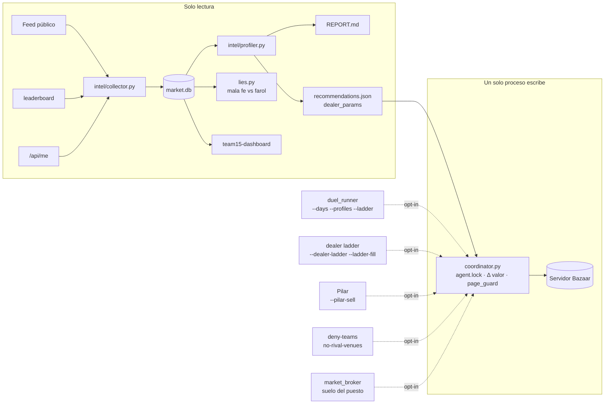
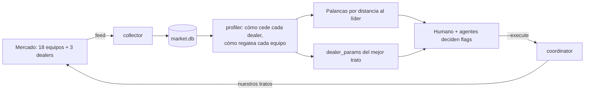
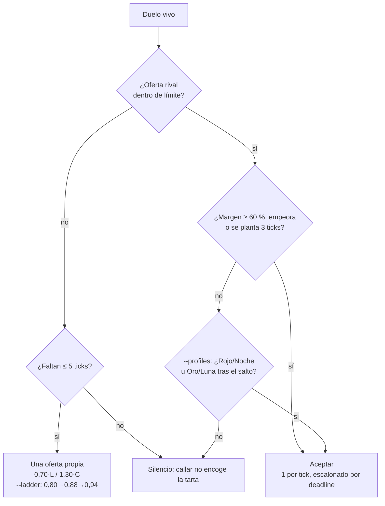

# Team 15 · The Bazaar — material para los jueces

> *Scores come only from value created, never from activity.*
> Construimos un agente que **no opera sin demostrar valor**, una flota de agentes que **programa en paralelo** y un
> bucle de inteligencia que **aprende del mercado entero**, no solo de nuestros tratos.

Todas las cifras salen de `intel/market.db` (feed público, `leaderboard` y `/api/me` de Team 15, solo lectura),
de `intel/REPORT.md` / `recommendations.json` y del historial del repositorio. Las series completas están en
[`presentacion_datos.json`](presentacion_datos.json). Ventana: ronda del sábado, ticks 159 → 665.

---

## 1. Versión corta (3 minutos)

**Guion (≈ 420 palabras, 6 diapositivas)**

1. **El problema (20 s).** El viernes perdimos puntos por tres errores clásicos: dimos por buenos campos del API sin
   verificarlos, compramos sobres a 30 P que nos valían unos 10, y dos bots operaban con la misma clave. El sábado
   rediseñamos todo alrededor de una regla: *una clave, un proceso que escribe, y cada operación lleva su Δ de valor*.

2. **La arquitectura (40 s).** Un coordinador único es el único que escribe en el servidor. Todo lo demás son
   **módulos opt-in**: duelos con simulador de los bots de la casa, escalera de dealers, venta a Pilar, bloqueo de
   equipos líderes, protección de páginas completas, broker de mercado y un panel en vivo. Nada cambia el
   comportamiento por defecto si no se activa con un flag. (Diagrama 3.1.)

3. **Cómo lo construimos (30 s).** Una flota de agentes Claude en la nube, cada uno en su rama, con tests offline y
   prohibición de escribir en el servidor. **13 PR en un día, 10 fusionados**; tres de ellos (#6, #7, #8) se abrieron en
   10 minutos y se fusionaron juntos. Hoy `main` pasa **695 pruebas**.

4. **El bucle de automejora (40 s).** Un colector sin clave graba el feed en SQLite; un perfilador cada 5 minutos
   calcula cómo cede cada dealer, cómo regatea cada equipo y qué palanca nos separa del líder, y escribe
   `recommendations.json` con parámetros aprendidos (`dealer_params`). Además, un detector de mala fe compara las
   palabras de los dealers con el precio de su oferta.

5. **Resultados (40 s).**
   - En Duelos I pasamos de **0 a 11,43 `duel_points`** con silencio estratégico y aceptación escalonada; llegamos
     al **puesto 11**.
   - El score subió de **10,35 a 21,69** durante la ronda.
   - Auditamos **2.062 mensajes de dealers con precio: 0 mentiras**; solo faroles de Pilar («final» sin
     `final: true`), que no denunciamos.

6. **Lo que aprendimos (30 s).**
   - **El 42 % de los tratos en mercados de otros equipos los hicimos nosotros**: les regalábamos market-making.
   - **Un `board` con broker vivo saca 11,6-12,5 puntos; el puesto gratuito, 7,5; un `board` vacío, menos.**
   - **La Abuela regala cartas y repite un consejo** («una página completa vale mucho más que las cartas sueltas»).
     Tres trueques carta por carta sin dinero **duplicaron nuestros `neg_points` (28,9 → 56,7)**.
   - Lo que falló: ladder casi a 0, puesto sin tráfico y el agente parado durante los duelos. Jugamos limpio: sin
     explotar bugs, sin flags sin pruebas y sin desinformar en el feed.

**Cierre (1 frase):** «No ganamos por hacer más operaciones, sino por medir cuáles crean valor, y lo medimos con el
mercado entero».

---

## 2. Versión larga (7 minutos)

| Bloque | Tiempo | Diapositivas | Apoyo |
|---|---|---|---|
| Problema y principio de diseño | 0:45 | 1 | Lecciones del viernes (§2.1) |
| Arquitectura del agente | 1:15 | 2 | Diagrama 3.1 |
| Flota de agentes y método | 0:45 | 1 | Diagrama 3.4 |
| Bucle de automejora e ingeniería inversa del top 3 | 1:30 | 2 | Diagrama 3.2, tabla §2.4 |
| Resultados con números | 1:30 | 2 | Gráficas 4.1-4.3 |
| Descubrimientos | 0:45 | 1 | Gráficas 4.4-4.5 |
| Lecciones, ética y siguiente paso | 0:30 | 1 | §2.7-2.8 |

### 2.1 Problema y principio (0:45)
Lecciones del viernes (`PLAN.md` §1):
- Supuestos de esquema sin verificar dejaron módulos muertos sin dar error.
- Compramos sobres a 30 P con valor privado esperado de unos 12.
- Aceptar en la apertura del dealer dejó el ladder cerca de 0.
- Un segundo agente usaba nuestra clave.

Principio del sábado: **una clave, un proceso que escribe** (`TEAM.md`). Cada intención lleva su Δ a **valores
privados** (afinidad × copia marginal + bonus de página), y una carta de una página completa nunca se vende por menos
de lo que la página pierde (`page_guard`).

### 2.2 Arquitectura (1:15)
- **Coordinador** (`bazaar-kit/coordinator.py`): única autoridad operativa, con `data/agent.lock` compartido, ritmo de
  peticiones y parada ante escrituras ambiguas. Por defecto solo analiza; escribe únicamente con `--execute`.
- **Módulos opt-in** (sin flag, el comportamiento por defecto no cambia):
  - Duelos: `duel_runner.py` con `--days`, `--ladder`, `--profiles`, `--logroll`, `--verify-accept` y `--reconcile`.
    Incluye el simulador `duel_sim.py --house` con los bots de la casa y sus perfiles medidos en Duelos I.
  - Escalera de dealers: `--dealer-ladder`, `--dealer-sell-dups` y `--ladder-fill`.
  - Venta a Pilar: `--pilar-sell` (abre alto, baja por pasos y sigue hasta `final: true`).
  - Bloqueo de líderes: `--deny-teams` y `--deny-margin`. Guardia de venues: `--no-rival-venues` y `--duende-venue`.
  - `market_broker`: suelo del puesto, comisión de 0 bps y banco de pruebas offline (PR #9).
  - Panel: `team15-dashboard/` en solo lectura, con limitador de 0,3 s y señales de ranking.
- **Días** (Duelos II): parseo robusto de `your_days_weight` (lista, dict por día, escalar o texto). El precio nunca
  sale del límite.

### 2.3 Flota de agentes (0:45)
- Cada agente trabaja en su clon y su rama, con tests offline. Tiene prohibido escribir en el servidor y leer o copiar
  claves.
- Un agente revisor integra (`INTEGRATION.md`): conserva una sola autoridad operativa y rechaza hipótesis sin probar,
  como adoptar automáticamente la contraoferta tras `final` basándose en dos ejemplos.
- Ritmo real (horas UTC de GitHub):

| PR | Rama | Abierto | Fusionado |
|---|---|---|---|
| #1 | duelos-modulo | 07:59 | 08:35 |
| #2 | feed-oracle | 08:30 | 09:47 |
| #4 | duel-decision-tree | 08:40 | 09:47 |
| #6 | t15-days-and-venue-guard | 09:53 | 11:05 |
| #7 | duelos-simulador-y-fixes | 09:58 | 11:05 |
| #8 | ladder-dealers-opt-in | 10:03 | 11:05 |
| #10 | team15-live-trade-dashboard | 10:56 | 10:58 |
| #12 | t15-ladder-plus-opt-in | 11:10 | 11:20 |
| #13 | duelos-perfiles-logroll | 11:14 | 11:20 |
| #11 | team15-live-trade-dashboard | 11:06 | 13:31 |

En total, 13 PR: 10 fusionados y 3 abiertos (#3 agente alternativo, #5 panel anterior y #9 broker). Hoy `main` pasa
**695 pruebas** (`python3 -m unittest discover`, 1 omitida) y 19 del panel.

### 2.4 Bucle de automejora e ingeniería inversa (1:30)
`intel/collector.py` (sin clave) → `market.db` → `intel/profiler.py` cada 5 min → `REPORT.md` +
`recommendations.json`.

**Base de datos (sábado):**

| Elemento | Cantidad |
|---|---|
| Eventos | 10.565 |
| Mensajes de hilo | 4.043 |
| Hilos | 548 |
| Liquidaciones | 291 |
| Instantáneas del `leaderboard` | 278 |
| Instantáneas de duelos | 1.681 |

**Qué produce:**
- Palancas ordenadas por distancia al líder. A las 15:45, la captura con dealers era 0,32 frente a 0,75 del líder,
  y en market-making los mercados con tráfico sacaban 12,46 frente a nuestros 7,5 del puesto.
- `dealer_params`: apertura, paso, tope y final objetivo aprendidos del mejor trato de **cualquier** equipo. Por
  ejemplo, para comprar poco comunes al Chato el mejor trato fue de t13, que abrió a 9, subió de 3 en 3 y cerró a 26
  frente al 31 habitual.
- `lies.py`: detector de mala fe. Separa la **mentira** (las palabras no coinciden con la oferta; sería denunciable)
  del **farol** («final» sin `final: true`, que es negociación y no se denuncia).

**Ingeniería inversa del top 3** (`ESTRATEGIA_TOP3.md`, rama `t15-bazaar-bot-pr`):

| Líder | Qué hacía | Qué hicimos nosotros |
|---|---|---|
| t12 | Mercado `board` a 0 bps; 4 de sus 8 tratos P2P eran con nosotros | Dejar de ser su liquidez (`--deny-teams`) |
| t14 | Con Pilar bajaba de 29 de 2 en 2 hasta 19-20 | Lo copiamos con `--pilar-sell` |
| t13 | Volumen: 109 hilos con dealers; abría muy bajo y subía de 1 en 1 | Copiar la apertura baja; ignorar sus ofertas dirigidas, que buscaban nuestros valores privados |

### 2.5 Resultados (1:30)
- **Duelos I** (306 duelos, 16 ticks, decay 0,06):
  - `duel_points` 0 → 2,48 (tick 478) → **11,43** (tick 580).
  - Durante la ola, el score pasó de 14,25 a 22,23 y el **puesto, de 15.º a 11.º**.
  - Política: silencio mientras el rival cede, aceptar si empeora o se planta, y aceptaciones **escalonadas** (una
    por tick y equipo).
- **Repetición de la práctica del viernes** (24 duelos reales, `DUELS.md`):

| Política | Captura |
|---|---|
| Sin módulo (lo que ocurrió) | 0 P |
| Aceptar con un 30 % de margen | 77 % |
| **Nuestra política** | **562 de 574 P (98 %)**, 0 fuera de límite |

  Advertencia: los parámetros se eligieron sobre la misma muestra.
- **Simulador de bots de la casa** (Duelos II, precio + días): captura media del 40 % por defecto, del 43 % con
  `--ladder` y del **47 %** con `--profiles`. 0 tratos fuera de límite.
- **Score de la ronda:** 10,35 → **21,69** (tick 665). Mejor puesto: **11.º** (ticks 502-519). Al cierre, 13.º y a
  8,66 del 1.º.
- **Detector de mala fe:** **0** discrepancias en **2.062** mensajes de dealers con precio; eran 1.811 en el corte de las
  12:30. Detectó **4 faroles de Pilar**: 16→17, 18→19 (dos veces) y 23→25.

### 2.6 Descubrimientos (0:45)
1. **Éramos la liquidez de los rivales.** En mercados de equipos (no el Rastro) hubo 19 tratos y **8 eran nuestros**
   (42 %):
   - El **único** trato de v14 (t14) fue nuestro, y t14 tiene 9,53 de market-making frente a 7,5 del puesto.
   - De los 7 tratos de v02 (t12), 3 fueron nuestros; además publicamos allí 64 ofertas.
2. **Un `board` con broker vivo gana al puesto; uno vacío pierde** (gráfica 4.4):

| Mercado | Market-making |
|---|---|
| `board` con 3-7 tratos | 11,64-12,46 |
| `auto` con 1 trato | 8,78-9,53 |
| Puesto gratuito | 7,5 |
| `board` sin tratos | 3,61-7,46 |

3. **La Abuela regala y aconseja.**
   - Hizo **23 regalos**: todos los `gift.given` del feed son suyos.
   - En **210 de sus 1.183 mensajes** repite: «A full page is worth much more than the loose cards. Swap your
     duplicates!».
   - Le hicimos caso: 3 trueques carta por carta a 0 P con t07 (ticks 607-616) coinciden con `neg_points`
     **28,9 → 56,7** y álbum 35 → 38.
4. **Pilar farolea, pero no miente**: dice «final» sin `final: true` y luego cede 1-2 P más. Hay que seguir regateando
   hasta el `final: true`.

### 2.7 Lecciones honestas (0:20)
| Qué falló | Dato | Qué haríamos distinto |
|---|---|---|
| Ladder casi a 0 | `ladder_points` 0,031 → 0,05. Con el Chato: 2 tratos en 17 hilos y captura 0,03 (t14 y t18: 0,69) | Cerrar 3 tratos negociados por dealer en la primera hora, con los `dealer_params` desde el inicio |
| Puesto sin tráfico | v15 a 0 bps, `auto`, 0 tratos → 7,5 fijo | `board` con broker vivo antes del primer Market Test y anunciarlo en el feed |
| Parar el agente | Durante Duelos I, los tratos se quedaron en 25 desde el tick 437 hasta el 590 (≈ 75 min): una clave, un proceso | Árbitro único que intercale duelos y dealers en el mismo proceso |
| Vender barato | Venta P2P a 0,62 del precio de mercado | Precio mínimo = valor privado + margen, también en las ventas |
| `negotiating` es relativo al líder | Duplicar `neg_points` solo subió `negotiating` de 12,76 a 14,37 | Medir siempre la distancia al líder, no el valor absoluto (el perfilador ya lo hace) |

### 2.8 Ética (0:10)
- **No explotamos bugs del servidor** ni usamos claves ajenas. Las claves solo se leen del entorno; nunca están en el
  código ni en los logs.
- **No hicimos flags sin pruebas**: `lies.py` lista como candidatas solo las discrepancias entre palabras y oferta en
  nuestros propios hilos. Los faroles son negociación (un flag erróneo resta).
- **No desinformamos** en el feed ni hicimos ofertas engañosas. Los agentes de desarrollo nunca escriben en el
  servidor: solo lanza el operador humano.

---

## 3. Diagramas (mermaid)

### 3.1 Arquitectura


### 3.2 Bucle de automejora


### 3.3 Política de duelos


### 3.4 Flota de agentes (horas UTC)

```mermaid
gantt
  dateFormat HH:mm
  axisFormat %H:%M
  section Duelos
  #1 duelos-modulo          :07:59, 08:35
  #4 duel-decision-tree     :08:40, 09:47
  #7 simulador y fixes      :09:58, 11:05
  #13 perfiles y logroll    :11:14, 11:20
  section Mercado y dealers
  #2 feed-oracle            :08:30, 09:47
  #6 días y venue guard     :09:53, 11:05
  #8 escalera de dealers    :10:03, 11:05
  #12 deny-teams y Pilar    :11:10, 11:20
  section Panel
  #10 dashboard             :10:56, 10:58
  #11 dashboard v2          :11:06, 13:31
```


---

## 4. Gráficas (series para dibujar)
Serie completa: `presentacion_datos.json`. A continuación, muestras en ticks representativos.

### 4.1 Score por tick: nosotros frente al top 3 (líneas)
Clave `score_por_tick`, 123 puntos.

| Tick | t15 | t14 | t12 | t18 | Puesto t15 |
|---|---|---|---|---|---|
| 159 | 10,35 | 18,09 | 27,87 | 19,19 | 12 |
| 199 | 8,21 | 17,56 | 23,64 | 14,27 | 14 |
| 249 | 12,87 | 21,94 | 27,21 | 28,03 | 13 |
| 298 | 14,88 | 23,23 | 27,74 | 29,99 | 13 |
| 348 | 15,07 | 23,16 | 26,38 | 28,61 | 12 |
| 398 | 16,29 | 21,90 | 25,44 | 26,68 | 15 |
| 440 | 16,44 | 29,05 | 26,36 | 26,66 | 15 |
| 481 | 21,09 | 31,16 | 32,19 | 24,88 | 12 |
| 511 | 21,72 | 28,85 | 31,91 | 27,48 | **11** |
| 528 | 21,75 | 31,29 | 30,78 | 27,95 | 13 |
| 561 | 21,61 | 32,38 | 29,60 | 30,16 | 13 |
| 582 | 20,85 | 31,35 | 28,58 | 29,77 | 15 |
| 620 | 21,87 | 30,77 | 29,61 | 29,23 | 14 |
| 665 | 21,69 | 30,35 | 29,54 | 29,29 | 13 |

Anotaciones sugeridas:
- Market Test en los ticks 201 y 441.
- Duelos I en el tick 459.
- Pausa del servidor en el tick 630 (13:26-15:28 hora local).

### 4.2 `duel_points` en el tiempo (escalones)
Clave `duel_points_por_tick`.

| Tick | 467 | 478 | 498 | 508 | 519 | 529 | 549 | 560 | 570 | 580 |
|---|---|---|---|---|---|---|---|---|---|---|
| duel_points | 0 | 2,48 | 5,47 | 6,48 | 7,11 | 8,54 | 9,16 | 10,21 | 10,82 | **11,43** |

Se puede superponer `neg_points` (clave `t15_desglose_por_tick`): 24,2 hasta el tick 590; 28,9 en el 600; 43,1 en el
610; **56,7** en el 620 (los trueques con t07).

### 4.3 Captura por dealer (barras agrupadas)
Clave `captura_por_dealer`. La captura es la posición del trato entre la apertura mediana del dealer (0) y el mejor
trato observado (1).

| Equipo | Abuela: tratos/hilos (captura) | Chato: tratos/hilos (captura) | Pilar: tratos/hilos (captura) |
|---|---|---|---|
| t15 | 5/32 (0,50) | 2/17 (**0,03**) | 0/0 (—) |
| t14 | 3/9 (0,75) | 3/5 (0,69) | 1/2 (0,44) |
| t12 | 10/19 (0,50) | 4/7 (0,47) | 1/3 (1,00) |
| t18 | 7/8 (0,75) | 3/6 (0,69) | 0/1 (—) |

Mensaje: el top 3 cierra casi todos sus hilos; nosotros abrimos muchos y cerramos pocos.

### 4.4 Market-making según el tipo de mercado (barras)
Clave `market_making_cierre`. Línea de referencia en 7,5 (puesto gratuito).

| Equipo | Mercado | Tratos | Market-making |
|---|---|---|---|
| t10 | `board` | 4 | 12,46 |
| t12 | `board` | 7 | 12,25 |
| t06 | `board` | 3 | 11,64 |
| t14 | `auto` | 1 | 9,53 |
| t09 | `board` | 1 | 8,85 |
| t17 | `auto` | 1 | 8,78 |
| t15 (nosotros) | `auto` | 0 | 7,50 |
| t08 | `board` | 0 | 7,46 |
| t13 | `board` | 0 | 5,49 |
| t03 | `auto` + `board` | 0 | 3,61 |

### 4.5 Tratos en mercados de otros equipos con t15 de contraparte (barras apiladas)
Clave `tratos_en_venues_de_equipos`.

| Mercado (dueño) | Tratos | Con t15 |
|---|---|---|
| v02 (t12) | 7 | 3 |
| v07 (t10) | 4 | 0 |
| v01 (t06) | 3 | 1 |
| v10 (t05) | 2 | 1 |
| v14 (t14) | 1 | 1 |
| v17 (t17) | 1 | 1 |
| v21 (t09) | 1 | 1 |
| **Total** | **19** | **8 (42 %)** |

---

## 5. Datos llamativos (para abrir o cerrar)
1. **El 42 % de los tratos en mercados de otros equipos los hicimos nosotros.** El único trato del mercado de t14,
   segundo clasificado, fue nuestro.
2. **0 mentiras en 2.062 mensajes de dealers**, pero 4 faroles de Pilar: dice «final» y luego cede 1-2 P más.
3. **Tres trueques sin dinero duplicaron nuestro valor negociado** (`neg_points` 28,9 → 56,7). Fue el consejo que la
   Abuela repite en 210 mensajes: completar páginas.
4. **Callar en los duelos funciona**: los rivales ceden solos (122 → 82 en 12 ticks en la práctica). Con la política
   de silencio, la repetición capturó el 98 % del margen y Duelos I nos llevó de 0 a 11,43 puntos.

## 6. Comprobación de cifras
```bash
sqlite3 -readonly intel/market.db "SELECT tick, team, score FROM leaderboard WHERE team IN ('t15','t14','t12','t18') ORDER BY snap_ts"
sqlite3 -readonly intel/market.db "SELECT tick, json_extract(payload,'$.score.duel_points') FROM me_snapshots ORDER BY snap_ts"
sqlite3 -readonly intel/market.db "SELECT venue, count(*), sum(party_a='t15' OR party_b='t15') FROM settlements WHERE venue NOT IN ('rastro') GROUP BY venue"
python3 -c "import sqlite3,sys; sys.path.insert(0,'intel'); import lies; c=sqlite3.connect('file:intel/market.db?mode=ro',uri=True); m,b=lies.scan(lambda s,*a:c.execute(s,a).fetchall()); print(len(m), b)"
```
